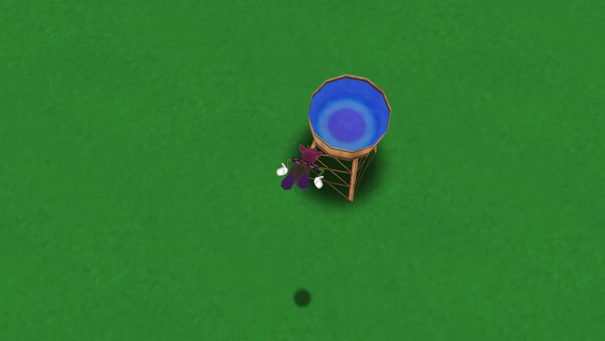
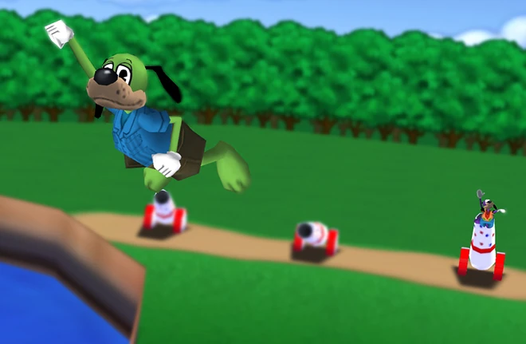

# Cannon Game



The objective is to change the angle on a cannon in order to get an accurate landing position into the water tower. 

## Getting Started

First, run the development server:

```bash
npm run dev
```

## Controls

All controls can be reconfigured via the settings menu. 

WASD keys - Angle Cannon

SPACE or Enter - Launch

## Multiplayer

Aiming to have multiplayer via P2P and Websockets. Websocket backend code is not in this repo or available at this time. P2P code will be included here.

## Inspiration

Inspired by the minigame inside Toontown

https://toontownrewritten.fandom.com/wiki/Cannon_Game



## Attributions

[Cannon Model]()  
[Barn Model]()  
[Water Tower Model]()  
[Duck Model]()  

[Grass Texture]()  

[Game Music]()  