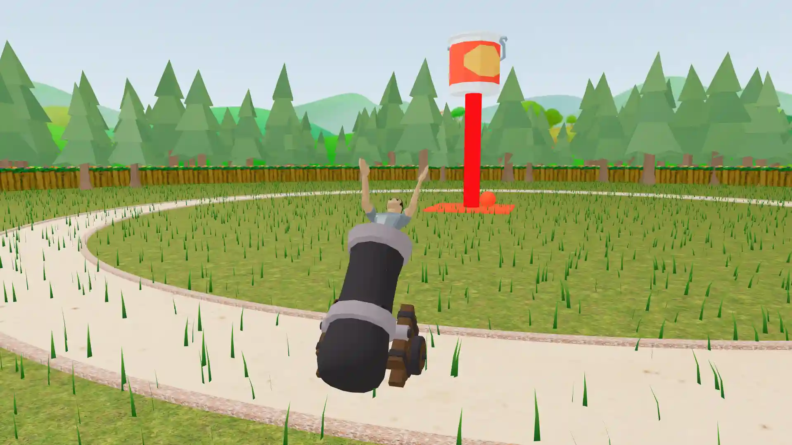
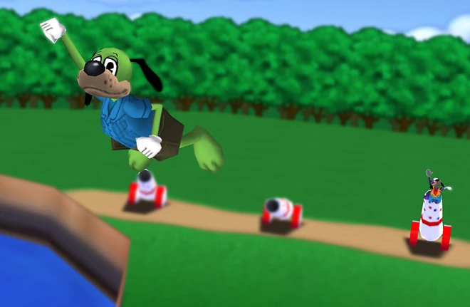

# Cannon Game



The objective is to change the angle on a cannon in order to get an accurate landing position into the water tower. 

## Getting Started

First you will need to setup a .env file from the .env.sample provided.

Then development server can be run:

```bash
npm run dev
```

## Controls

All controls can be reconfigured via the settings menu. 

WASD keys - Angle Cannon

SPACE or Enter - Launch

✅ Keyboard
✅ Touch
✅ Gamepad (Xbox One Controller)

## Multiplayer

Aiming to have multiplayer via P2P and Websockets. Websocket backend code is not in this repo or available at this time. P2P code will be included here.

## TODO

Multiplayer game loop still being worked on

## Scripts

In the scripts folder is reset_public and sync_to_s3. This is only for Articles Media usage. Allows for putting public folder to CloudFront to lower Vercel charges for the public facing site.

## Inspiration

Inspired by the minigame inside Toontown

https://toontownrewritten.fandom.com/wiki/Cannon_Game



## Attributions

[Cannon Model - Quaternius](https://poly.pizza/m/J15vlPVvKK)  
[Water Tower Model]()  

[Grass Texture - Poliigon](https://www.poliigon.com/)  

[Game Music]()  